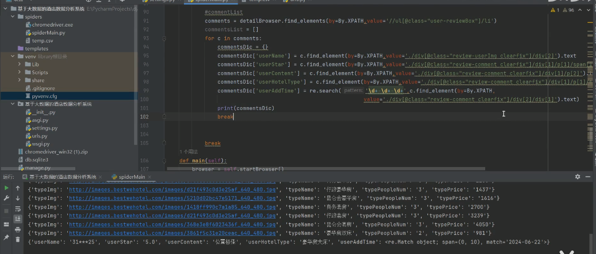
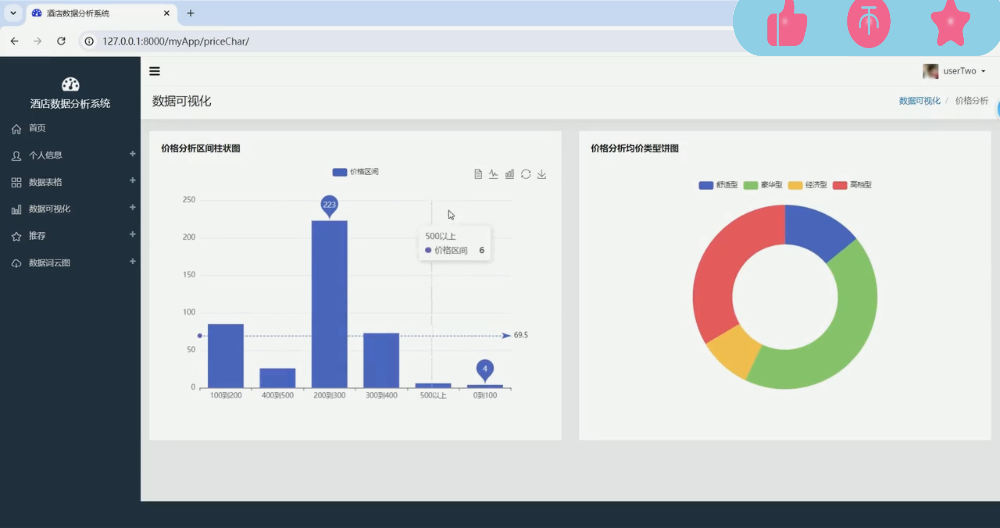
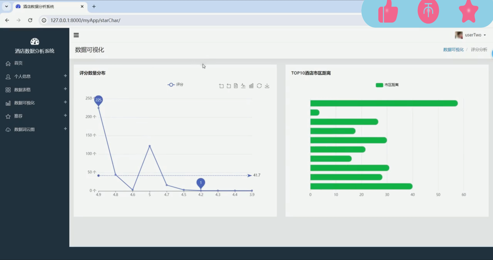
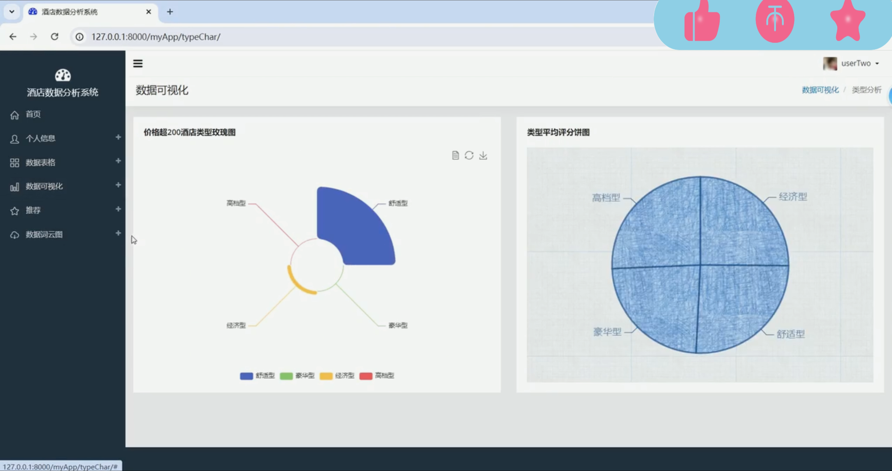
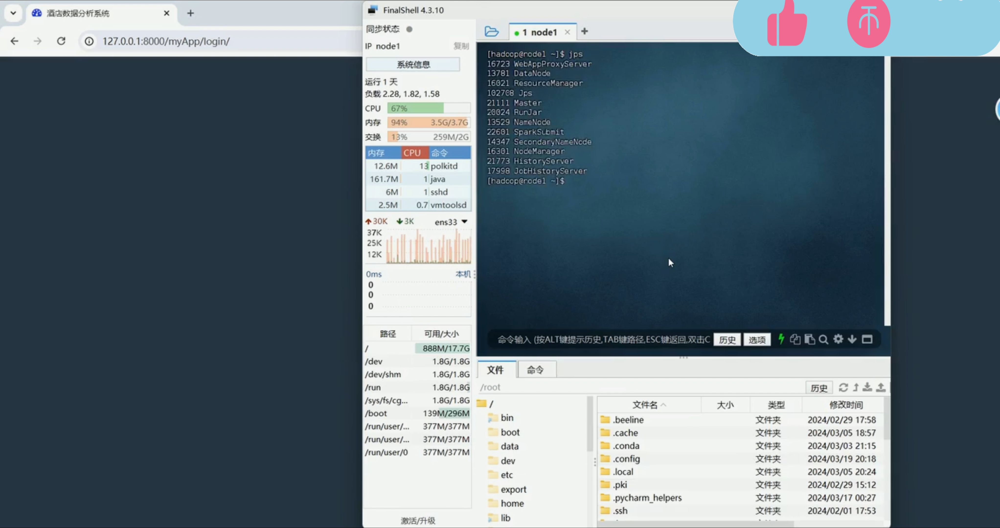
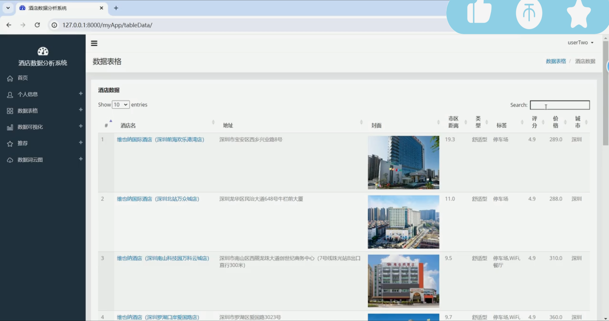
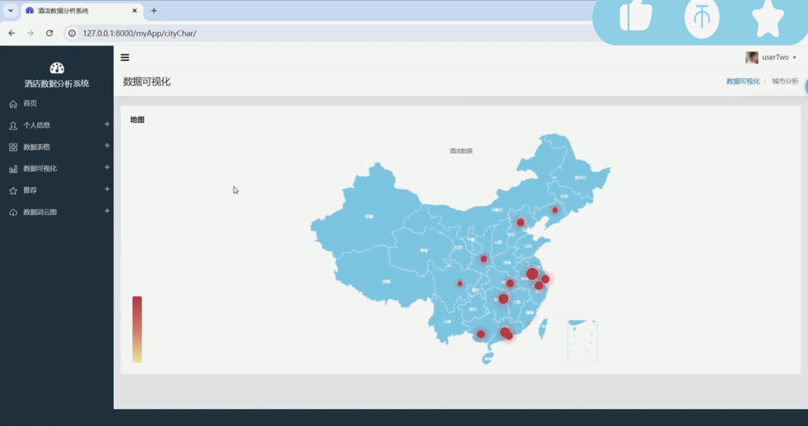
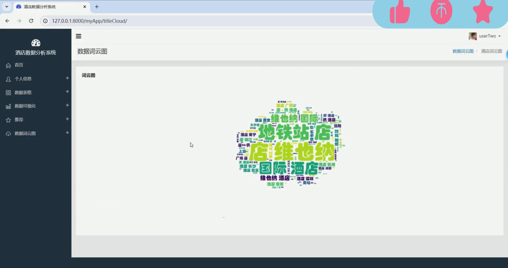
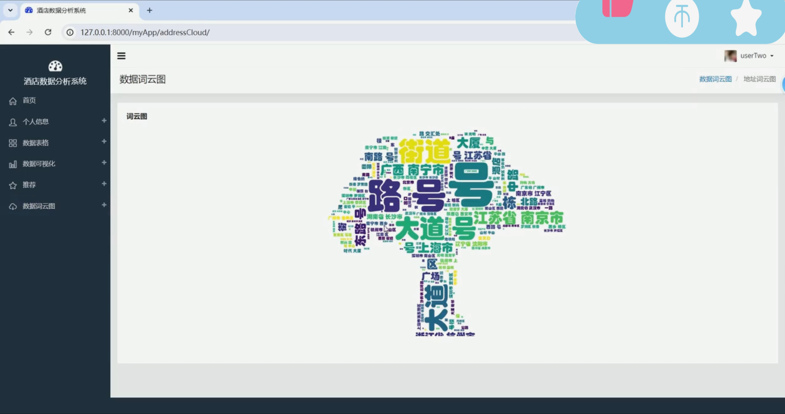
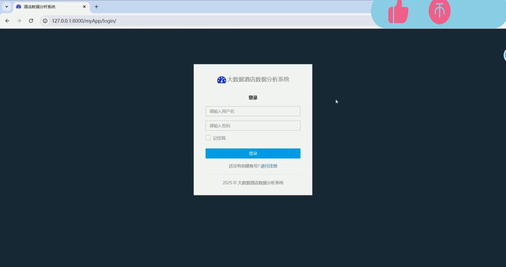

## 计算机毕业设计hadoop+spark+hive酒店推荐系统 酒店数据分析可视化大屏 酒店爬虫  酒店预测系统 大数据毕业设计 Sqoop

## 要求
### 源码有偿！一套(论文 PPT 源码+sql脚本+教程)

### 
### 加好友前帮忙start一下，并备注github有偿酒店推荐数仓25
### 我的QQ号是2827724252或者798059319或者 1679232425或者微信:bysj2023nb 或bysj1688

# 

### 加qq好友说明（被部分 网友整得心力交瘁）：
    1.加好友务必按照格式备注
    2.避免浪费各自的时间！
    3.当“客服”不容易，repo 主是体面人，不爆粗，性格好，文明人。
	
## 技术
数据分析Spark、数据库Hive、MySQL 服务器Djano、爬虫Selenium	

## 演示视频
https://www.bilibili.com/video/BV1MHHYeWE9p/

## 运行截图

